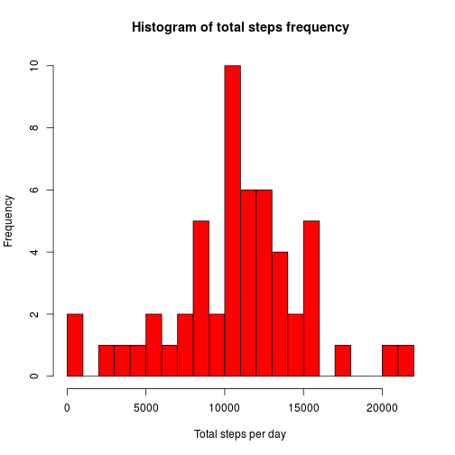

# Reproducible Research: Peer Assessment 1

This assignment makes use of data from a personal activity monitoring device. This device collects data at 5 minute intervals throughout the day. The data consists of two months of data from an anonymous individual collected during the months of October and November, 2012 and includs the number of steps taken in 5 minute intervals each day.


The variables included in this dataset are:

* steps: Number of steps taking in a 5-minute interval (missing values are coded as NA)

* date: The date on which the measurement was taken in YYYY-MM-DD format

* interval: Identifier for the 5-minute interval in which measurement was taken

The dataset is stored in a comma-separated-value (CSV) file and there are a total of 17,568 observations.

## Loading and preprocessing the data

Set working directory to correct GitHub repo and create a temporary directory for unzipping and extracting the .zip file.


```r
  setwd("~//coursera/repos/RepData_PeerAssessment1/")
  tdir <- tempdir()
```

Get the name of the first file in the zip archive and extract it


```r
  flist <- unzip("activity.zip", list=T)
  fname <- flist$Name
  unzip("activity.zip", files = fname, exdir = tdir, overwrite =T)
```

Get full path to extracted file and load .csv file into dataframe.


```r
  fpath <- file.path(tdir,fname)
  activityData <- read.csv(fpath, header = T)
```

Convert date column into date type and transform interval column into equally spaced intervals.


```r
  activityData$date <- as.Date(activityData$date)
  interval <- seq(0,1435, by=5)
  activityData$interval <- rep.int(interval,61)
```


## What is the mean total number of steps taken per day?

Calculate the total number of steps per day, plot a histogram and calculate and report the mean and median steps per day. This is done by aggregating the number of steps for different dates.


```r
  totStepsDay <- aggregate(activityData$steps, list(date = activityData$date), sum)
  hist(totStepsDay$x, col="red", xlab="Total steps per day", main="Histogram of total steps frequency")
```

 

```r
  mean(totStepsDay$x, na.rm = T)
```

```
## [1] 10766
```

```r
  median(totStepsDay$x, na.rm = T)
```

```
## [1] 10765
```

Alternatively, one can plot the total number of steps per day to get an overview of the activity during the 2 months of measurements taken.


```r
  barplot(totStepsDay$x, names.arg = totStepsDay$date, xlab="Day", ylab="Total steps", border="blue", main="Number of total steps per day")
```

 


## What is the average daily activity pattern?

Aggregate the dataset with respect to the 5-minute intervals in order to calculate the mean steps for each interval. In order to obtain a result different from "NA", it is important to set na.rm = TRUE. The interval with the maximum number of steps can be obtained with the max() function and added to the plot via abline().


```r
      totStepsInt <- aggregate(activityData$steps, list(Interval = activityData$interval), mean, na.rm = T)
      colnames(totStepsInt)[2] <- "Steps"
      maxSteps <- max(totStepsInt$Steps)
      maxSteps
```

```
## [1] 206.2
```

```r
      maxInt <- totStepsInt[totStepsInt$Steps==maxSteps,]  
      plot(totStepsInt, type="l", main="Average steps for each 5-minute interval")
      abline(v=maxInt$Interval, col="red1")
      text(maxInt, "206.2 steps @ 515 interval ", pos=4, col="red1")
```

 

## Inputing missing values

1. Calculate and report the number of missing values in the dataset


```r
      totNA <- sum(is.na(activityData$steps))
      totNA
```

```
## [1] 2304
```

2. Devise a strategy for filling in all of the missing values

Since we already calculated the average number of steps per interval, I chose to substitute each missing value by the according 5-minute interval average.

3. Create a new dataset that is equal to the original dataset but with the missing data filled in.


```r
      for (i in 1:nrow(activityData)) {
            if (is.na(activityData$steps[i])) {
                  ithInterval <- activityData$interval[i]
                  activityData$steps[i] <-totStepsInt[totStepsInt$Interval==ithInterval,]$Steps
            }
      }
```

4. Make a histogram of the total number of steps taken each day and calculate and report the mean and median total number of steps taken per day.

      For allowing a better comparison between old and new dataset, it is useful to put them in one plot.


```r
# Calculate total steps per day for new dataset
      totStepsDay2 <- aggregate(activityData$steps, list(date = activityData$date), sum)
# Plot two overlapping histograms
# Plot 1 
      histwoNA <- hist(totStepsDay2$x, plot = FALSE)
      plot(histwoNA, xlab="Total steps per day", main="Comparison of steps frequency with and without NAs", col="blue")
# Plot 2
      histwithNA <- hist(totStepsDay$x, plot = FALSE)
      plot(histwithNA, main="", add = TRUE, col="red")
# Add a legend
      legend('topleft',c('Without NAs','With NAs'), fill = c("blue", "red"), bty = 'n', border = NA)
```

 

```r
# Calculate mean and median for new dataset
      mean(totStepsDay2$x, na.rm = T)
```

```
## [1] 10766
```

```r
      median(totStepsDay2$x, na.rm = T)
```

```
## [1] 10766
```

      Inserting the missing NAs in the dataset has no considerable effect to the mean and median. As expected, the frequency of the total steps per day increases, since there are now more steps introduced. The difference in total steps can be seen if both datasets (i.e. with and without NAs) are plotted on top of each other .


```r
      par(mfrow=c(2,1))
      barplot(totStepsDay$x, names.arg = totStepsDay2$date, xlab="", ylab="Total steps", border="red", main="Number of total steps per day with NAs")
      barplot(totStepsDay2$x, names.arg = totStepsDay2$date, xlab="Day", ylab="Total steps", border="blue", main="Number of total steps per day without NAs")
```

 


## Are there differences in activity patterns between weekdays and weekends?

For this part the dataset with the filled-in missing values is used.

1. Create a new factor variable in the dataset with two levels -- "weekday" and "weekend" indicating whether a given date is a weekday or weekend day.


```r
# Create new column with abbreviated days
      activityData$day <- weekdays(activityData$date, abbreviate = T)
# Annotate days by either weekend or weekdays
      activityData$day <- ifelse(activityData$day %in% c("Sam","Son"), "weekend", "weekday")
# Convert column to factor type
      activityData$day <- as.factor(activityData$day)
```

2. Make a panel plot containing a time series plot (i.e. type = "l") of the 5-minute interval (x-axis) and the average number of steps taken, averaged across all weekday days or weekend days (y-axis).


```r
# Aggregate according to interval and day columns
      activityType <- aggregate(activityData$steps, by=list(Interval=activityData$interval,Day=activityData$day), mean)
# Use ggplot2 to have two factes for weekday and weekend
      library(ggplot2)
      ggplot(activityType) + geom_line(aes(x=Interval,y=x, col=Day)) + facet_wrap(~ Day) + ylab("Number of steps") + ggtitle("Average number of steps per 5-minutes interval")
```

 

      The activity plots indicate similar patterns for weekdays and weekends. In comparison to weekdays the steps taken during weekends are more evenly distributed. During weekdays the peak around 500 minutes could indicate the steps on the way to work.
